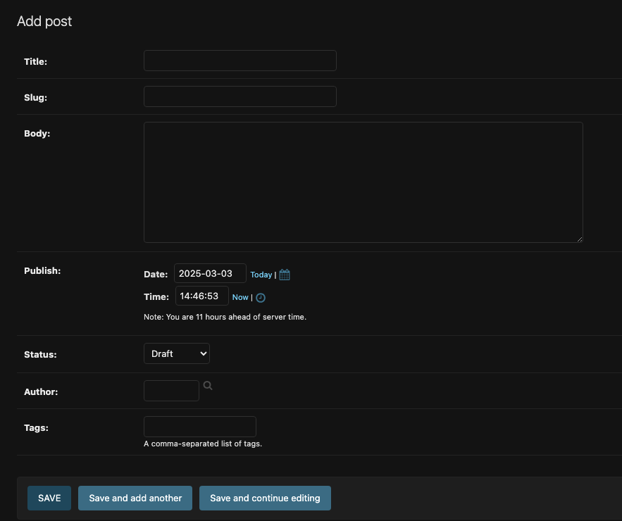

# Blog Application

A simple blog application that allows users to navigate through all published posts and read individual posts.

## Table of Contents

- [Features](#features)
- [Installation](#installation)
- [Configuration](#configuration)
- [Screenshots](#screenshots)

## Features

List the key features of the project:

- Using Canonical URLs for models
- Created SEO-friendly URLs for posts
- Added pagination to the post list page to navigate through all posts.
- Built class-based views
- Sending emails with Django [Google's SMTP server with a standard GMAIL account]
- Added comments to posts using forms from models.
- Implemented tagging using django-taggit
  - Categorizing posts using tags: A tag is simply a label or keyword that can be assigned to posts.
- Retrieving posts by similarity.
- Created custom template tags and filters to display the latest posts and most commented posts.
- Added sitemap to the site
  - Created a sitemap for search engines to crawl your site and an RSS feed for users to subscribe to the blog.
- Created feeds for blog posts
- Implemented a full-text search engine with Django and PostgreSQL
  - Django provides a powerful search functionality built on top of PostgreSQL database full-text search features.

## Installation

### Prerequisites

Ensure you have the following installed:

- Python (version 3.12.4)
- Django (version 5.0.4)
- PostgreSQL

### Steps to Install

1. Clone the repository:
   ```sh
   git clone https://github.com/yourusername/yourproject.git
   cd yourproject
   ```
2. Create and activate a virtual environment:
   ```sh
   python -m venv django5_env/
   source django5_env/bin/activate
   ```
3. Install dependencies:
   ```sh
   pip install -r requirements.txt
   ```
4. Set up the database:
   ```sh
   python manage.py migrate
   ```
5. Create a superuser (optional for admin access):
   ```sh
   python manage.py createsuperuser
   ```
6. Run the development server:
   ```sh
   python manage.py runserver
   ```
7. Installing postgreSQL
   ```sh
    docker pull postgres:16.2
   ```
   Start the PostgreSQL Docker container
   ```sh
    docker run --name=blog_db -e POSTGRES_DB=blog -e POSTGRES_USER=blog -e POSTGRES_PASSWORD=xxxxx -p 5432:5432 -d postgres:16.2
   ```
8. Using fixtures to dump and load data into the database.

   ```sh
    python manage.py dumpdata --indent=2 --output=mysite_data.json
   ```

   If you get an encoding error when running the command, include the -Xutf8 flag as follows to activate Python UTF-8 mode:

   ```sh
    python -Xutf8 manage.py dumpdata --indent=2 --output=mysite_data.json
   ```

## Configuration

### Environment Variables

Create a `.env` file and configure the following variables in the bookmarks directory:

```
DEBUG=True
EMAIL_HOST_USER=
EMAIL_HOST_PASSWORD=
DEFAULT_FROM_EMAIL=
DB_NAME=
DB_USER=
DB_PASSWORD=
DB_HOST=
```

## Screenshots

Below are some screenshots of the application:

### Blog Posts


### Create Post



### POST Details


### Posts Tagged With Jazz


### Share Post By Email


### Received Shared Post Email


### RSS Feed


### Search For Posts


### Search Result Post


